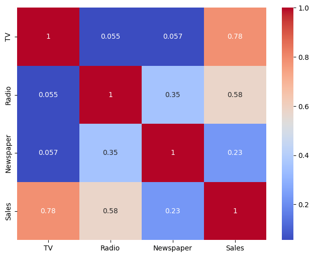
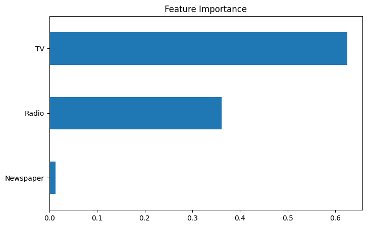
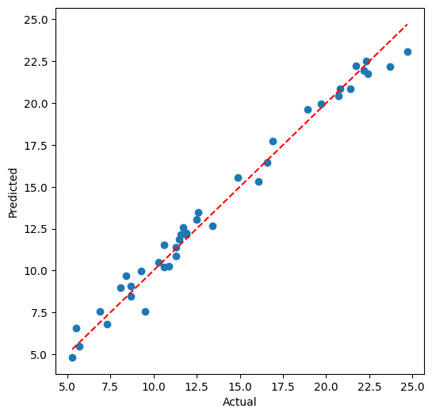
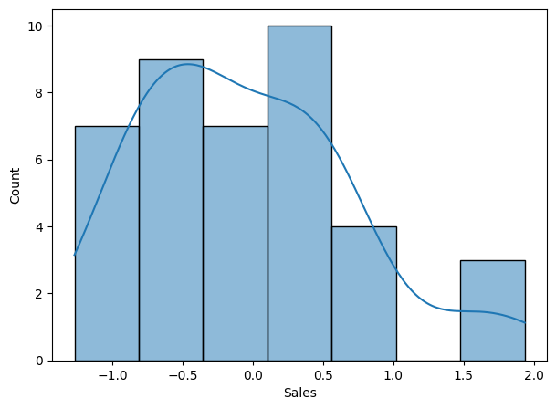

# 📈 CodeAlpha - Sales Prediction using Machine Learning


---

# 📌 Project Overview

This project was completed as part of the **CodeAlpha Machine Learning Internship**.

The objective of this project is to predict future product sales using advertising expenditure on different marketing platforms such as **TV, Radio, and Newspaper**. Machine Learning regression models are used to understand the relationship between advertising investment and sales performance, helping businesses optimize their marketing budget and improve Return on Investment (ROI).

The project demonstrates the complete Machine Learning workflow, including data preprocessing, exploratory data analysis, model training, evaluation, and deployment preparation.

---

# 🎯 Objectives

- Analyze the advertising dataset.
- Clean and preprocess the data.
- Perform Exploratory Data Analysis (EDA).
- Understand the relationship between advertising spend and sales.
- Train multiple regression models.
- Compare model performance using evaluation metrics.
- Predict future sales based on advertising budgets.
- Generate business insights for marketing decision-making.

---

# 📂 Dataset Information

| Feature | Description |
|----------|-------------|
| TV | TV advertising budget |
| Radio | Radio advertising budget |
| Newspaper | Newspaper advertising budget |
| Sales | Product sales (Target Variable) |

---

# ⚙️ Machine Learning Workflow

```
Load Dataset
      │
      ▼
Data Cleaning
      │
      ▼
Exploratory Data Analysis
      │
      ▼
Correlation Analysis
      │
      ▼
Feature Selection
      │
      ▼
Train-Test Split
      │
      ▼
Train Multiple Models
      │
      ▼
Hyperparameter Tuning
      │
      ▼
Model Evaluation
      │
      ▼
Sales Prediction
      │
      ▼
Save Model
```

---

# 🧰 Technologies Used

- Python
- Pandas
- NumPy
- Matplotlib
- Seaborn
- Scikit-learn
- Joblib
- Google Colab

---

# 🤖 Machine Learning Models

- ✅ Linear Regression
- ✅ Decision Tree Regressor
- ✅ Random Forest Regressor
- ✅ Gradient Boosting Regressor

---

# 📊 Model Evaluation Metrics

The following metrics were used to evaluate model performance:

- Mean Absolute Error (MAE)
- Mean Squared Error (MSE)
- Root Mean Squared Error (RMSE)
- R² Score
- Cross Validation Score

---

# 🏆 Best Performing Model

After comparing multiple algorithms, the **Random Forest Regressor** delivered the best predictive performance with the highest R² Score and the lowest prediction error.

---

# 📈 Key Business Insights

- TV advertising has the strongest influence on product sales.
- Radio advertising also contributes significantly to sales growth.
- Newspaper advertising has a comparatively lower impact.
- Increasing investment in high-performing advertising channels can improve overall sales.
- Machine Learning helps businesses make data-driven marketing decisions and optimize advertising budgets.

---

# 📸 Project Visualizations

## Correlation Heatmap

```markdown

```

---

## Feature Importance

```markdown

```

---


---

## Actual vs Predicted Sales

```markdown

```

---

## Residual Distribution

```markdown

```

---

# 📁 Project Structure

```
CodeAlpha_SalesPrediction
│
├── Sales_Prediction.ipynb
├── Advertising.csv
├── sales_prediction_model.pkl
├── requirements.txt
├── README.md
└── images
      ├── heatmap.png
      ├── feature_importance.png
      ├── sales_distribution.png
      ├── advertising_distribution.png
      ├── actual_vs_predicted.png
      └── residual_plot.png
```

---

# 🚀 Installation

Clone the repository

```bash
git clone https://github.com/YourUsername/CodeAlpha_SalesPrediction.git
```

Move into the project directory

```bash
cd CodeAlpha_SalesPrediction
```

Install dependencies

```bash
pip install -r requirements.txt
```

Launch Jupyter Notebook

```bash
jupyter notebook
```

---

# 📊 Sample Prediction

Example Input

| TV | Radio | Newspaper |
|----|--------|-----------|
| 250 | 35 | 45 |

Predicted Sales

```
Approximately 21–24 units
```

*(The exact prediction depends on the trained model.)*

---

# 💻 Future Scope

- Deploy the model as a Streamlit web application.
- Integrate real-time marketing campaign data.
- Use advanced models such as XGBoost or LightGBM.
- Build a dashboard for marketing budget optimization.
- Automate sales forecasting for business planning.

---

# 👨‍💻 Author

**Jamshed Ahmad**

Machine Learning Intern | Data Science Enthusiast

- 🔗 LinkedIn: *www.linkedin.com/in/jamshed-ahmad007*
- 💻 GitHub: *https://github.com/Jamshed-Ahmad*

---

# ⭐ Internship Project

This project was successfully completed as part of the **CodeAlpha Machine Learning Internship Program**. It demonstrates the practical application of supervised machine learning techniques for sales prediction and business analytics, enabling organizations to make informed, data-driven marketing decisions.
